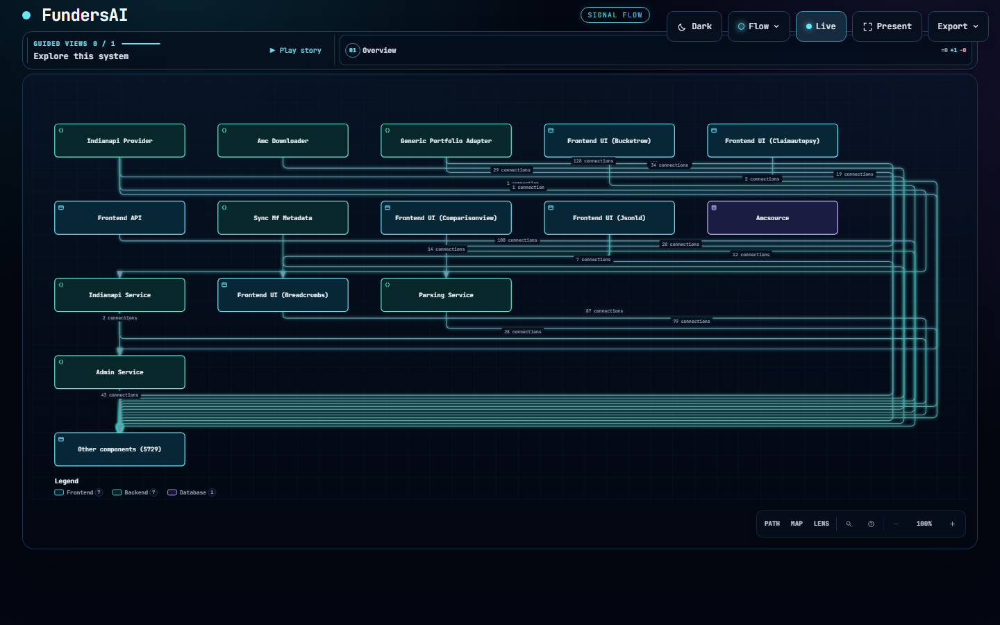
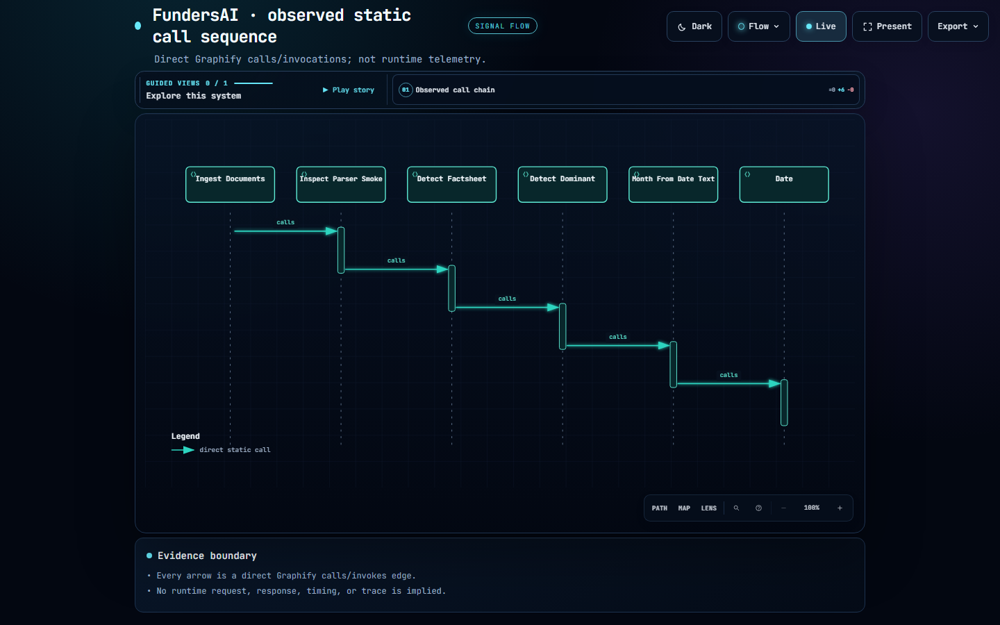

# Graphitect

**Turn an existing codebase into one interactive architecture report.**

Graphitect produces a self-contained HTML artifact for project walkthroughs,
technical interviews, handoffs, and architectural review. It has two sections:

1. **Interactive system diagram** — generated locally from the repository.
2. **Project explanation** — technical choices, mechanisms, trade-offs, and
   pros/cons, with every statement marked confirmed or inferred.



*A real Graphitect architecture overview generated from FundersAI. The embedded viewer supports
pan, zoom, route controls, hover details, dark mode, presentation mode, a
full relationship rollup, and an evidence-gated static call sequence when the
source graph contains a direct call chain.*

## Why Graphitect

Reading a repository is slow when a graph tells you only **what** connects and
a prose summary tells you only **why**. Graphitect combines both without
letting a model invent the diagram:

| Layer | What it does |
| --- | --- |
| **Graphify** | Extracts code structure, direct relationships, and communities locally. It is the deterministic source for diagram nodes and edges. |
| **Archify** | Renders the bundled, interactive architecture, workflow, and sequence views. |
| **Graphitect** | Turns that evidence into one portable HTML report and verifies any file-backed explanation citation before publishing it. |

The diagram does not require an LLM or API key. The explanation can come from
a configured standalone provider or the model already running inside Codex,
Claude Code, or another Agent Skills-compatible host.

## Requirements

- Python 3.10+
- Node.js 18+ for the bundled Archify renderer

Graphify and Archify are bundled with Graphitect. You do **not** install
Graphify separately or run `npm install` for Archify.

## Install

### From this repository

```bash
git clone https://github.com/Naman6019/graphitect.git
cd graphitect
python -m pip install .
```

### From PyPI

```bash
python -m pip install graphitect
```

Confirm that the renderer runtime is available:

```bash
node --version
graphitect --help
```

## Quick start

```bash
graphitect build /path/to/project -o project-architecture.html
```

This produces one standalone HTML file. Open it in any modern browser; it does
not need a server or an internet connection after generation.

Without an LLM key, Graphitect still produces Section 1 and plainly marks
Section 2 as unavailable. To explicitly omit the diagram:

```bash
graphitect build /path/to/project --no-diagram -o project-explanation.html
```

## Add the detailed explanation

### Standalone CLI

Configure one supported provider, then use the same command:

```bash
# PowerShell example — do not commit keys to your repository.
$env:GEMINI_API_KEY = "..."
graphitect build /path/to/project -o project-architecture.html
```

Supported environment variables are `GEMINI_API_KEY` (or `GOOGLE_API_KEY`),
`ANTHROPIC_API_KEY`, and `OLLAMA_API_KEY`. A local Ollama server is also
supported through `--ollama-local`.

### Installed agent skill — no separate API key

When the Graphitect skill runs inside Codex, Claude Code, or another compatible
agent host, the host's selected model writes Section 2. Graphitect itself makes
no LLM network call in this path.

```bash
# Run from the repository you want the agent to understand.
graphitect skill export --host codex

# Or install the Claude Code variant.
graphitect skill export --host claude-code
```

Then ask the host agent to use Graphitect for the repository. The skill runs
this evidence-first handoff:

```bash
graphitect agent prepare /path/to/project -o .graphitect-agent
# The host model writes .graphitect-agent/narrative.json from grounded evidence.
graphitect agent compile .graphitect-agent --title "Project name" -o project-architecture.html
```

Graphitect owns the diagram in this mode. The host model can write only the
narrative; it cannot add, remove, or rename Graphify nodes and edges. A
confirmed code claim must cite a repository-relative file and a full phrase
from that file. Unverified, uncited, externally referenced, or fabricated
user-backed claims are downgraded to **inferred**.

For another Agent Skills-compatible host, export the portable bundle to its
skill location:

```bash
graphitect skill export --output ./skills/graphitect
```

## What the report contains

### Section 1 — Interactive system diagram

- Overview: a readable structural subset of the Graphify graph.
- Full architecture rollup: every retained relationship in a scrollable view.
- Guided workflow story: a paced, direct path through observed relationships.
- Sequence trace: shown only for consecutive direct `calls` or `invokes`
  relationships; it is static source evidence, never runtime telemetry.
- Per-block hover details: source path, symbol, relationship context, and
  legacy naming context where a function name might be mistaken for a provider.



*A source-derived sequence view. Every arrow represents a direct Graphify
`calls` or `invokes` relationship; no runtime request, timing, or trace data
is implied.*

### Section 2 — Project explanation

- Architecture and component walkthrough.
- Technology choices and the evidence behind them.
- Trade-offs, alternatives, strengths, and costs.
- Related diagram components for each section.
- Confirmed versus inferred labels, plus optional author questions for
  unresolved, load-bearing rationale.

## Evidence rules

Graphitect keeps the distinction between repository fact and analysis visible:

- **Confirmed**: backed by code, README, docs, Git history, or a direct author
  answer. File-backed citations must contain the cited phrase.
- **Inferred**: a reasoned interpretation or recommendation. It is useful, but
  never presented as a proven historical decision.
- Diagram relationships: direct Graphify extraction, not an LLM reconstruction.

If `synthesize --non-interactive` or the agent workflow writes
`graphitect-questions.json`, fill its `answer` fields and rerun with
`--answers`. Unanswered items remain inferred.

## Advanced commands

```bash
# Write reusable Graphify-grounded data.
graphitect ground /path/to/project -o grounding.json

# Synthesize from that data with a configured standalone provider.
graphitect synthesize grounding.json --repo /path/to/project -o understanding.json

# Render a saved understanding file.
graphitect deliver understanding.json --title "Project name" -o project-architecture
```

For normal use, prefer `graphitect build` or the installed-agent workflow.

## Privacy and network behavior

- Graphify extraction and diagram generation run locally.
- The self-contained report embeds its interactive viewer; viewing it requires
  no hosted Graphitect service.
- Standalone explanation generation sends the bounded evidence context to the
  provider you configure.
- Installed-agent mode uses the host agent's own model and permissions instead
  of a Graphitect API key.

Review your repository and provider policy before sending source context to an
external model.

## Bundled projects and notices

Graphitect bundles Graphify under its Apache-2.0 distribution terms and
Archify under MIT plus its third-party notices. See `licenses/graphify/`,
`licenses/archify/`, and the root notice files for details.
